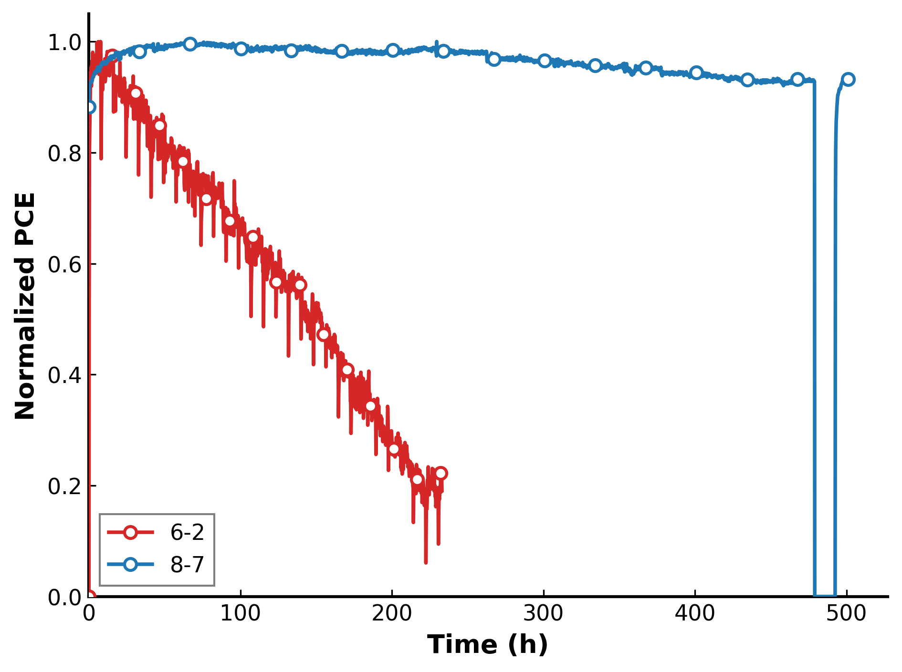
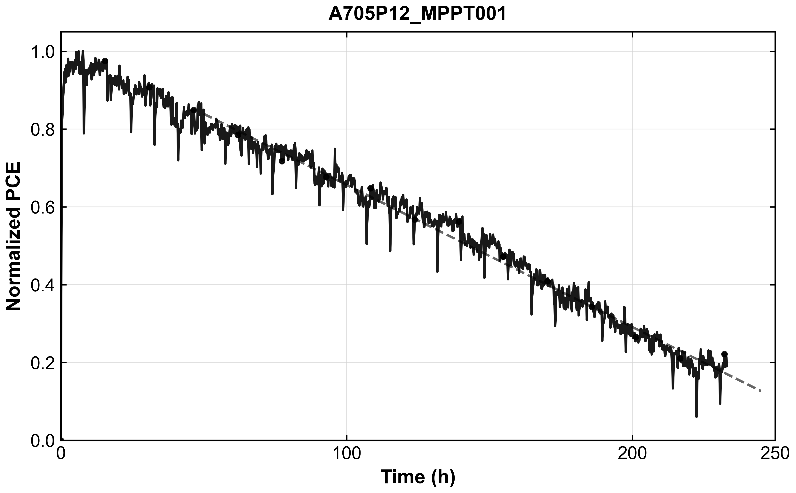
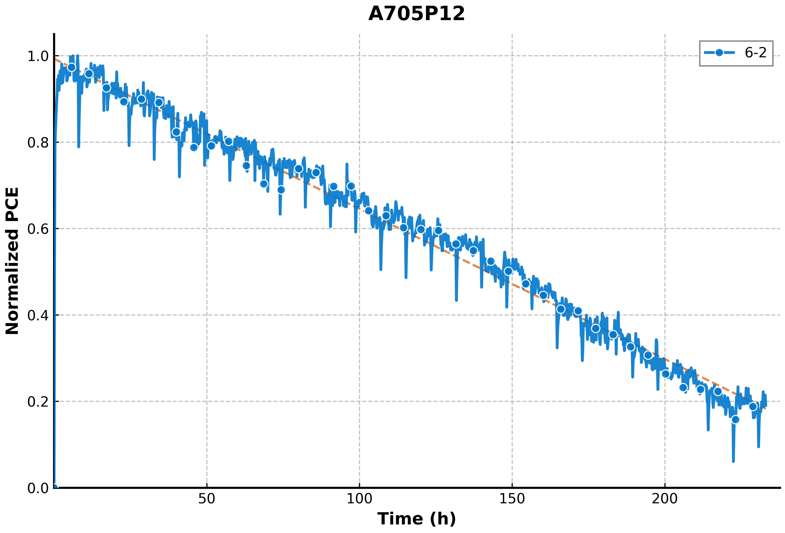
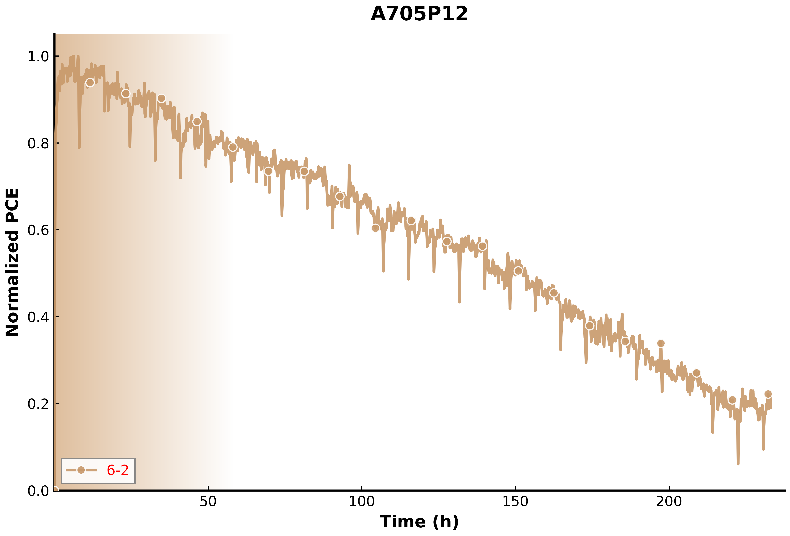

# Perovskite MPPT Curve Visualization Dataset

A dataset-generation project that converts experimental perovskite solar-cell measurements into four types of curve figures for visual learning. The repository contains processed maximum power point tracking (MPPT) data, the Python scripts used to render the curves, and the resulting image dataset.

<p align="center">
  
</p>

## Project Objective

The objective is to transform experimental stability measurements into visually diverse scientific curve images. The numerical MPPT data are preprocessed into elapsed time and normalized power conversion efficiency (PCE), then rendered with different visual elements such as colors, markers, grids, fitted lines, backgrounds, and multi-curve overlays.

The generated figures can be used as image data for visual learning, scientific figure understanding, curve-pattern recognition, and experiments on visual robustness across plotting styles.

## Data-to-Figure Workflow

```text
Experimental perovskite MPPT data
                │
                ▼
  Elapsed-time calculation and Pmax normalization
                │
                ▼
         Processed curve CSV files
                │
                ├── assistline
                ├── assistline_overlap
                ├── colour
                └── multi
                         │
                         ▼
              Visual-learning image dataset
```

The current release includes:

- 30 processed perovskite device datasets.
- 73,242 normalized time-series points.
- 90 single-device figures across three categories.
- 12 multi-device figures in the fourth category.
- 102 high-resolution PNG figures in total.
- Scripts for preprocessing measurements and regenerating the visualizations.

## Four Figure Categories

| Category | Files | Visual style |
| --- | ---: | --- |
| `figure/assistline/` | 30 | Single-device curves with sampled markers, a reference grid, and a linear-fit auxiliary line |
| `figure/assistline_overlap/` | 30 | Blue single-device curves with gray dashed reference lines and an overlapping orange fitted trend line |
| `figure/colour/` | 30 | Tan single-device curves with mixed solid/hollow markers and a brown-to-white gradient background |
| `figure/multi/` | 12 | Two- or three-device curves overlaid in contrasting colors for direct stability comparison |

The first three categories provide different visual renderings of individual experimental curves. The `multi` category combines selected devices in a single figure. Together, the four categories introduce controlled visual variation while preserving the underlying perovskite stability behavior.

## Repository Structure

```text
.
├── code/
│   ├── preprocess.py           # Converts raw perovskite MPPT exports to plotting metadata
│   ├── assistline.py           # Single-device plot with a linear fit
│   ├── assistline_overlap.py   # Single-device plot with grid and trend overlay
│   ├── colour.py               # Single-device tan/gradient style
│   ├── multi-2.py              # Two-device comparison plots
│   └── multi-3.py              # Two- and three-device comparison plots
├── data_csv/                   # 30 processed, flat CSV datasets
├── figure/
│   ├── assistline/             # Single-device figures with a fitted trend
│   ├── assistline_overlap/     # Single-device figures with grid/trend overlays
│   ├── colour/                 # Single-device color-style figures
│   └── multi/                  # Multi-device comparison figures
└── README.md
```

## Data Format

Each processed CSV contains the following columns:

| Column | Description |
| --- | --- |
| `ID` | Device or measurement identifier |
| `Figure` | Figure index |
| `Sub-figure` | Subfigure label |
| `Value_x` | Newline-separated elapsed-time values in hours |
| `Value_y` | Newline-separated normalized PCE values |
| `Legend` | Device-structure or dataset label |
| `X-label` | Label for the x-axis |
| `Y-label` | Label for the y-axis |
| `Title` | Optional figure title |

The included collection contains 73,242 time-series points across 30 device files. Measurement durations range from approximately 233 to 624 hours. A device identifier in `data_csv/` can be matched to figures with the same identifier under the single-device figure directories.

## Intended Use

- Visual learning from perovskite stability-curve images.
- Scientific plot and curve-pattern recognition.
- Visual representation learning across different plotting styles.
- Evaluation of model robustness to colors, grids, markers, fitted lines, and backgrounds.
- Understanding and comparison of single-device and multi-device stability curves.

This repository provides the generated data and plotting workflow, but it does not define a specific learning model or official training, validation, and test split. When creating such splits, group images by device ID so that different renderings of the same experimental curve do not leak across training and evaluation sets.

## Requirements

- Python 3.9 or later
- NumPy
- pandas
- Matplotlib

Install the dependencies in a virtual environment:

```bash
python3 -m venv .venv
source .venv/bin/activate
python -m pip install --upgrade pip
python -m pip install numpy pandas matplotlib
```

On Windows, activate the environment with `.venv\Scripts\activate`.

## Configuration

The scripts currently contain a `BASE_DIR` constant inherited from the original local workflow. Before running a script, change this value to the absolute path of your cloned repository:

```python
BASE_DIR = "/absolute/path/to/photovoltaic-mppt-stability-plots"
```

The two comparison scripts read the included flat files from `data_csv/` and write new images to `multi_csv/`.

The single-device scripts use the following nested input layout:

```text
data/
└── <device-name>/
    └── metadata_pv.csv
```

That nested source tree and the original instrument exports are not included in this repository. The corresponding pre-generated figures are available under `figure/`.

## Visualization Workflow

### Generate two-device comparisons

Edit the `PAIRS` list and, if necessary, `X_MAX_MAP` in `code/multi-2.py`, then run:

```bash
python code/multi-2.py
```

Each tuple in `PAIRS` must use a filename from `data_csv/` without the `.csv` extension.

### Generate two- and three-device comparisons

Edit the `PAIRS` list in `code/multi-3.py`, then run:

```bash
python code/multi-3.py
```

This script supports both two-item and three-item tuples and uses red, blue, and green curves.

### Run the archived preprocessing workflow

`code/preprocess.py` expects two upstream inputs that are not included here:

- `原始数据/`: raw MPPT exports, either standard timestamp-column CSVs or supported instrument-specific CSVs.
- `器件结构.csv`: a mapping from device IDs to legend labels.

The script calculates elapsed time, applies min–max normalization to `Pmax`, and writes plotting metadata. Review its input/output paths before using it with new data.

### Generate single-device figures

After preparing the nested `data/<device>/metadata_pv.csv` layout, update the relevant paths and run one of:

```bash
python code/assistline.py
python code/assistline_overlap.py
python code/colour.py
```

## Examples of the Four Figure Categories

| `assistline` | `assistline_overlap` |
| --- | --- |
|  |  |
| `colour` | `multi` |
|  |  |

## Reproducibility and Dataset Notes

- All plotting scripts use Matplotlib's `Agg` backend and can run without a graphical display.
- Arial is requested for several styles; Matplotlib falls back to an available sans-serif font when Arial is unavailable.
- The plotting scripts sort samples by elapsed time and pair `Value_x` and `Value_y` entries up to their shared length.
- The preprocessor uses min–max normalization: `(Pmax - min(Pmax)) / (max(Pmax) - min(Pmax))`.
- Generated images are high resolution and may require additional memory when processing many devices.
- Multiple figure styles may originate from the same underlying experimental curve. Treat them as related samples when designing machine-learning splits.
- The generated figures are intended for visual-learning and scientific-visualization research; they are not device-lifetime certification results.

## License and Data Use

No license is currently included. Before redistributing the code or experimental data, add an appropriate software license and confirm that the datasets may be shared publicly.
